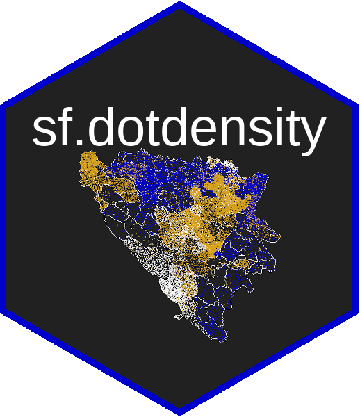
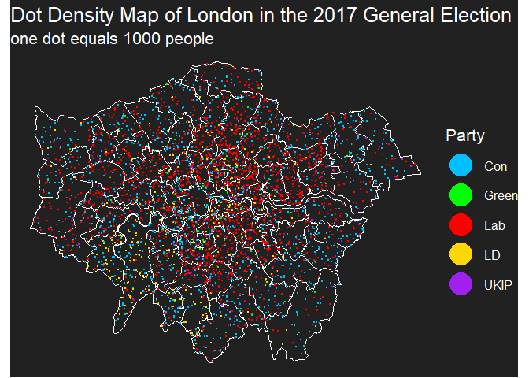
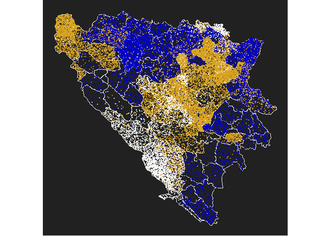

README
================

<!-- README.md is generated from README.Rmd. Please edit README.Rmd (this file) -->

 \#
# sf.dotdensity 
## Simple Dot Density Maps using sf

A packaged version of Paul Campbell’s blogpost found
[here](https://web.archive.org/web/20180928043346/https://www.cultureofinsight.com/blog/2018/05/02/2018-04-08-multivariate-dot-density-maps-in-r-with-sf-ggplot2/).
Hopefully should allow for faster generation of dot density maps for
people wanting to emulate the post. Also contains the data from the
blogpost as an example.

### Functions

Package contains two functions in ./R - random\_round() straight from
Paul Campbell’s blogpost and Jens von Bergmann’s package for dot
densitys. Rounds numbes up or down randomly - calc\_dots() modified Paul
Campbell’s blogpost pipeline into a function in base R to calculate the
random position of dots within a shapefile

### Examples

Two examples are presented below. The first using the data from the
original blogpost. A second one scraping South African census 2011 data
from [Adrian Frith’s site](https://census2011.adrianfrith.com) to plot
the distribution of primary languages within the country. Both are
plotted using custom theme elements from the original blog.

``` r
#load libraries
library(sf)
#devtools::install_github("RobWHickman/sf.dotdensity")
library(sf.dotdensity)

#load the data
london_shapefile <- sf.dotdensity::london_shapefile
london_election_data <- sf.dotdensity::london_election_data

#get the data to plot
#merge a shapefile with the population data
london_sf_data <- merge(london_shapefile, london_election_data, by = "ons_id")

#the columns we want to select and plot
parties <- names(london_sf_data)[4:8]
#set up a colour scale for these if so inclined
colours = c("deepskyblue", "red", "gold", "purple", "green")
names(colours) = parties

#how many people should lead to one dot
people_per_dots = 1000

#calculate the dot positions for each column
london_dots <- calc_dots(df = london_sf_data,
                         col_names = parties,
                         n_per_dot = people_per_dots)

#plot the results
library(ggplot2)
london_plot <- ggplot() +
  #first add the shape as a background
  geom_sf(data = london_sf_data, fill = "transparent",colour = "white") +
  #add the dots
  geom_point(data = london_dots, aes(lon, lat, colour = variable), size = 0.5) +
  #colour based on the scale already defined
  scale_colour_manual(name = "Party", values = colours) +
  #title
  ggtitle("Dot Density Map of London in the 2017 General Election",
          subtitle = paste("one dot equals", people_per_dots, "people")) +
  theme_dotdensity() +
  #make the legend shapes bigger so it's possible to see them clearly
  guides(colour = guide_legend(override.aes = list(size = 10)))

#plot
london_plot
```

<!-- -->

Another good example using Bosnian ethnicity data (which is used in the
package hex sticker) can be found
[here](https://twitter.com/majda_ruge/status/1037704253043879936). The
data needed to reproduce this figure is contained within the package and
the code is provided
below.

``` r
bosnia_sf_data <- merge(bosnia_shapefile, bosnia_ethnicity_data, by = "district")
bosnia_sf_data[is.na(bosnia_sf_data)] <- 0

#we'll only focus on the three most prominent ethnicities
ethnicities <- c("Bosniak", "Serb", "Croat")
bosnia_palette <- c("goldenrod", "mediumblue", "white")
names(bosnia_palette) <- ethnicities

bosnia_dots <- calc_dots(bosnia_sf_data, col_names = ethnicities, n_per_dot = 100)

bosnia_plot <- ggplot() +
  geom_sf(data = bosnia_shapefile, fill = NA, colour = "white") +
  geom_point(data = bosnia_dots, aes(lon, lat, colour = variable), 
             size = 0.5, alpha = 0.7, shape = 19) +
  scale_colour_manual(name = "Party", values = bosnia_palette) +
  theme_dotdensity(legend = FALSE) +
  guides(colour = guide_legend(override.aes = list(size = 10)))

bosnia_plot
```

<!-- -->
